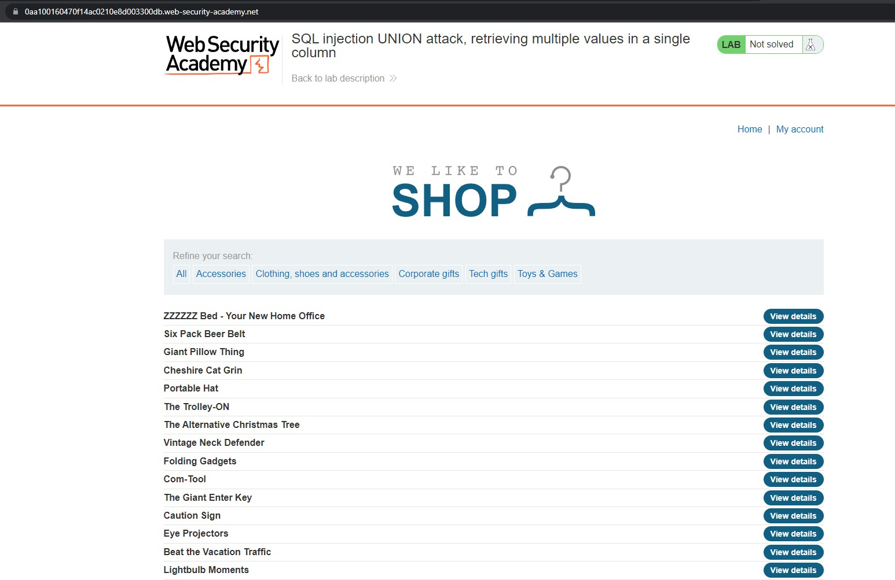

# Burpsuite Academy (SQL injection UNION attack, retrieving multiple values in a single column)

## Challenge: 

## Solution:
This challenge requires us to use manual SQLi to first find the number of columns present, find which column has the string data type, find the username and password columns from the users table and to dump the database.

Firstly, I went to the challenge homepage.

Secondly, I clicked onto the `categories` tab which showed me the following page.

Looking at the GET parameter, it seems like it is interacting with a back-end database.

Hence, I tried to inject a single quote and obtained the `Internal Server Error` message.

Moving on, I tried to determine the number of columns present in the original `SELECT` query, using the command `' UNION SELECT NULL -- -`, which gave the following output.

After incrementing the number of columns and trying again, I obtained the following output.

This shows that there are 2 columns in the original `SELECT` statement.

Next, I had to determine which columns contain the string data type. Using the command `' UNION SELECT 'a',NULL -- -`, I received the `Internal Server Error` message. Hence, I decided to try for the second column. Luckily, the second column is of string data type.

Moving on, I tried to find the tables and columns that store sensitive information such as usernames and passwords. I tried the command `' UNION SELECT NULL,CONCAT(table_name,':', column_name) FROM information_schema.columns -- -` and managed to ouput all the tables and columns present.

Using `CTRL-F` and searching for `users`, I found that there are 2 columns, `username` and `password` for the `users` table.

Next, I used the command `' UNION SELECT NULL,CONCAT(username,':',password) FROM users -- -` to dump the users table.

Lastly, I was able to login as the `administrator` account, solving this challenge. :')

