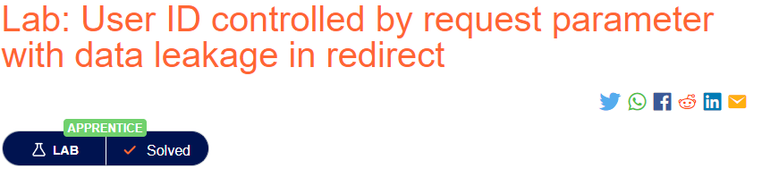

# Burpsuite Academy (User ID controlled by request parameter with data leakage in redirect)

## Challenge: 

## Solution:
This challenge requires us to exploit an access control vulnerability to obtain Carlos's API key.

To start off, we login to wiener's account using the provided credentials.

Next, using Burpsuite Proxy, we obtained the following request.

Moving on, we decided to change the `id` parameter in the GET request to become `carlos`. With that, we were able to obtain carlos' API key.

With that, we have successfully completed this lab!

