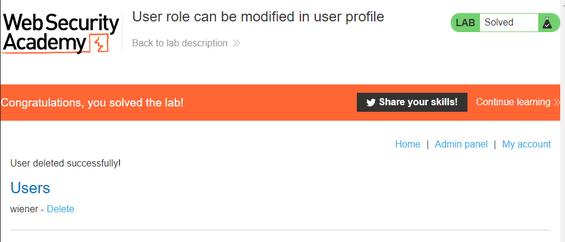

# Burpsuite Academy (User role can be modified in user profile)

## Challenge: 

## Solution:
This challenge requires us to use the update email function to update the roleid to 2, to be able to access the admin page.

Firstly, we log in using the provided credentials `wiener:peter`. 

Secondly, we were able to use the update email function to update Wiener's email address.

Next, using Burpsuite, we saw that the request was in JSON format and the reply from the web server returned crucial information such as the roleid.

Next, we decided to change the roleid and set it to be 2, as stated in the challenge description.

Finally, we were able to delete the user `Carlos` on the admin panel, allowing us to complete this challenge.

