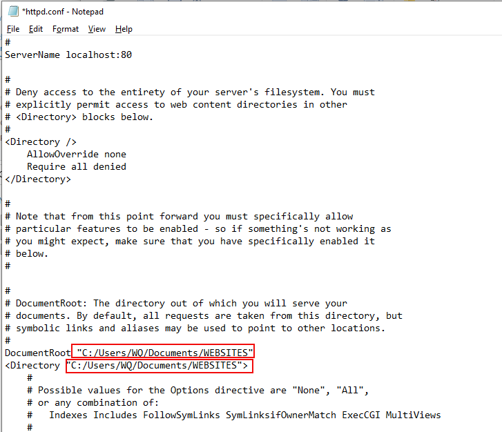

# Configurations (Changing XAMPP Webroot)

## Challenge: 

To change the XAMPP webroot to `C:\Users\WQ\Documents\WEBSITES`. 

## Solution:

The solution is largely based on this Stackoverflow [link](https://stackoverflow.com/questions/18902887/how-to-configuring-a-xampp-web-server-for-different-root-directory).

Firstly, go to the Apache Control Panel and click on the `httpd.conf` file. 

Next, use `Ctrl-F` to search for `htdocs`.

Replace the following `DocumentRoot` and `<Directory>` values to your preferred directory.

If you do not have virtual host configurations in `httpd-xampp.conf`, you have successfully completed the steps to change the XAMPP webroot. Else, read on.

Next, open up `httpd-xampp.conf` from the Apache Control Panel.

Search for htdocs and replace the values in `DocumentRoot` to your site name.

.

After saving the files, restart Apache server and restart your browser. Your page should load from the specified webroot.

