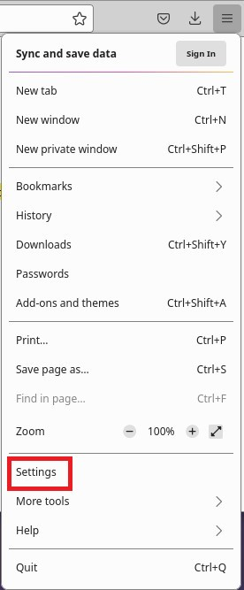
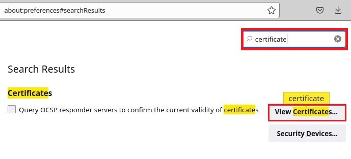
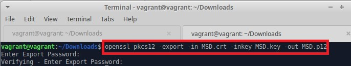
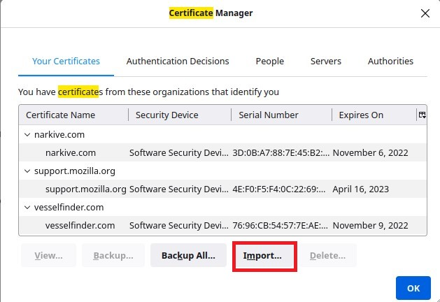
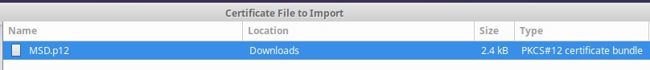

# Import Certificate to Firefox

## Steps:

1. Head over to `Settings` on Firefox browser. 

2. Next, search `certificate` in the settings search bar and click on `View Certificates`.

3. Open terminal and type the command `openssl pkcs12 -export -in MSD.crt -inkey MSD.key -out MSD.p12` as Firefox and Chrome browser can only import key and cert together if they are inside a PKCS#12 file but not when they are in PEM format.

4. Moving on, click on `Import` to import the PCKS#12 file that was generated.

