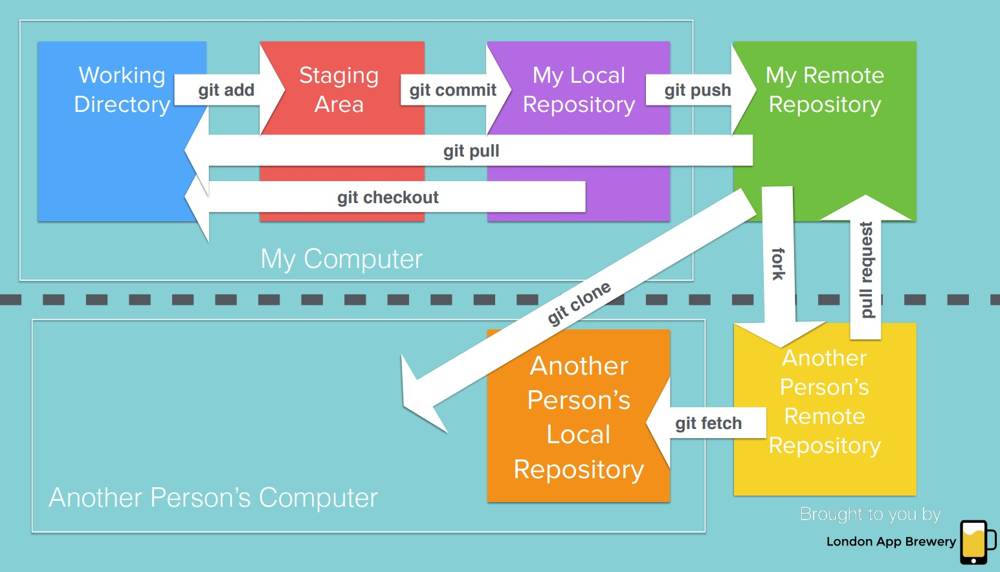

# Git/Github Crash Course

## Table of Contents

|No.|Title|
|---|---|
|1|[Basic Git Commands](#basic-git-commands)|
|2|[Adding SSH keys to Github](#adding-ssh-keys-to-github)|
|3|[Pushing local repos to Github](#pushing-local-repos-to-github)|
|4|[Gitignore files](#gitignore-files)|
|5|[Forking & Pull Requests](#forking-and-pull-requests)|
|6|[Git Cheatsheet](#git-cheatsheet)|

### Basic Git Commands

To initialize git on local respository (to become Working Directory):
```
git init
```

To start tracking changes to files in Working directory:

```
git add .
```

To look at staging area (to choose which file to commit):
```
git status
```

To remove files from staging area:
```
git rm --cached secrets.txt
git rm --cached -r .
```

To commit files:
```
git commit -m "what changes were made, in present tense"
```

To see what commit has been made:
```
git log
```

To see modifications between current version of file and last saved point in current repos
```
git diff <filename>
```

To revert to last committed version of the file:
```
git checkout <filename>
```

Cloning Git project (Pull from Remote repo to working directory)

```
git clone <url>
```

Creating a new branch:
```
git branch <new branchname>
```

Check what branches are present;
```
git branch
```

Switch to other branch:
```
git checkout <branchname>
```

### Adding SSH keys to Github

To start off, use the command `ssh-keygen -t ed25519 -C "your_email@example.com"` to generate your SSH keys.


The public key is located at `/c/Users/WQ/.ssh/id_ed25519.pub`. Using the command `cat /c/Users/WQ/.ssh/id_ed25519.pub`, I obtained the public key.


Next, login to Github and click on the `SSH and GPG keys` tab. Next, click on the `New SSH key` button.


Following that, add a title and the public SSH key and click `Add SSH key` 


### Pushing local repos to Github

Firstly, initialize your local repository with `git init`. Add all the files in the working directory to the staging area with `git add.` . Commit the files using `git commit -m "Initial Commit" `.

Secondly, ensure that your SSH key had been added to Github. On Github, click on `New Repository` 
and press `Create repository`. 


Thirdly, copy the ssh string ending with `.git`.


Next, on the terminal, use `git remote add origin git@github.com:wong-qiang/story.git` to set remote repository to that of Github. Finally, use the command `git push origin master` to push the local repository to Github.


### Gitignore files
`.gitignore` is a plain text file where each line contains a pattern for files/directories to ignore

Example:
```
.DS_Store
node_modules/
.env
```

Refer to Github's [offical Gitignore repo](https://github.com/github/gitignore) for samples.

### Forking And Pull Requests

Forking is NOT cloning. Forking is copying a Github repository to your own Github account, making you the owner of the copy of the repository. Cloning is pulling the remote repository to the working directory.

Pull requests occurs when the owner of the forked copy wants the owner of the original repository to merge changes that he made.

Pull request in action:

Firstly, the `story` repository is created by user `wong-qiang` and it contains `file1.txt`.


Another user - `n000ber` is able to fork the `story` repository, making him the owner of the forked copy.


`n000ber` then proceeded to create `file2.txt`, which he committed and pushed to his forked copy.


If `n000ber` thinks that his changes should be reflected in the original repository, he can create a Pull Request.


The original owner would be able to to view the Pull Request and decide whether to merge the changes.


Finally, the original repository will contain the changes made by `n000ber`, which is the addition of `file2.txt`.


### Git Cheatsheet


