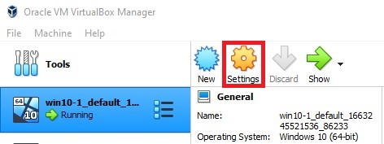
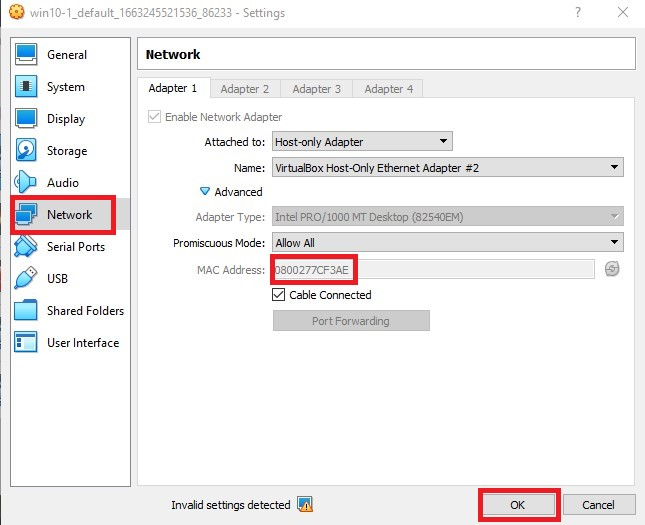

# Troubleshoot Inter-VM Connectivity

## Error

When pinging another host on the same subnet (connected via the same VirtualBox Host-Only Ethernet Adapter), received the error, `Reply from <Own IP>: Destination host unreachable.` 

* Firewall has been disabled.
* IPv6 has been disabled (some online sources attribute it as a possible cause).
* Hosts in other subnet are able to ping to both the hosts in the subnet.

## Solution

This occurred as both VMs have the same MAC address (since they are identical copies of one another, verifiable using Wireshark capture). 

This causes the same IP address to be mapped to different MAC address, making it invalid. Hence, changing the MAC address on one VM should solve this connectivity issue.

To change the MAC address on a VM, head to the `settings` tab on the VirtualBox.

Next, click on the `Network` tab and change the MAC address to a different value. Select `ok` after the changes were made and restart the computer.

