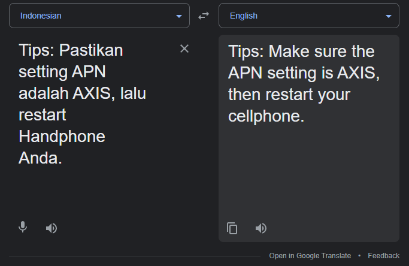
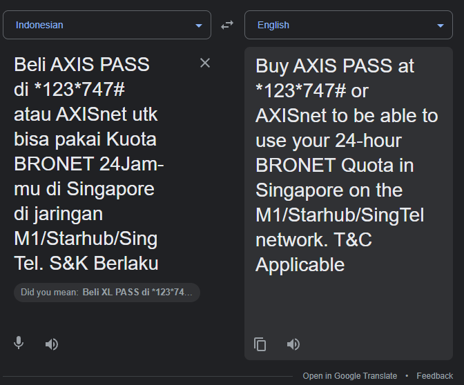
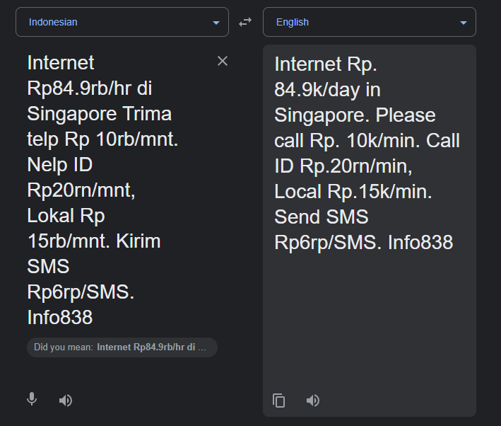
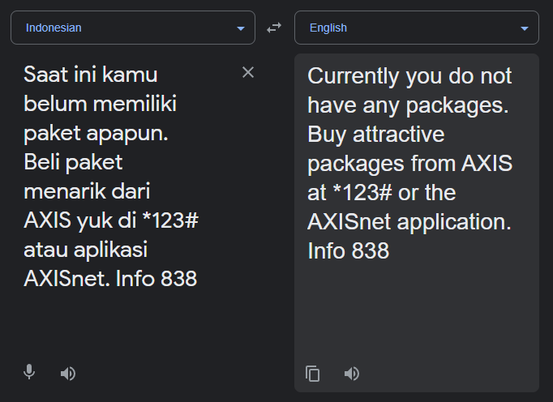
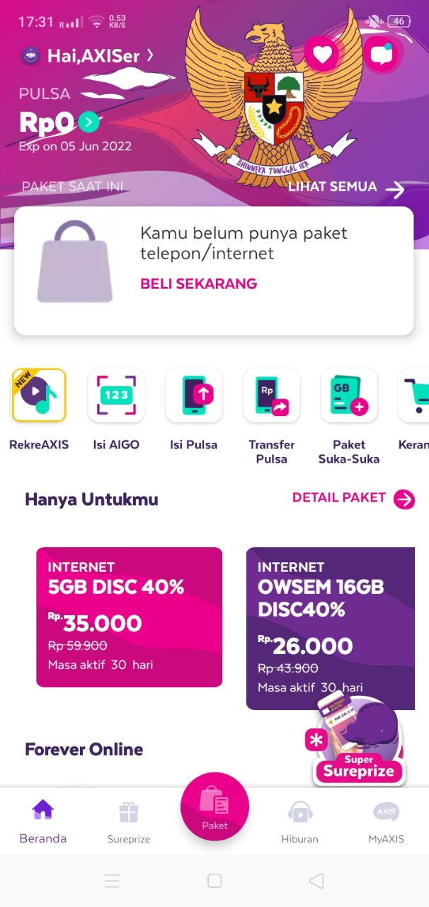

# Sim card Enumeration

## Challenge: 

I've found a SIM card laying on the ground in public, and decided to do some SIM card enumeration.

## Solution:

Upon inserting the SIM card, I received these three SMS messages in quick sucession.

Dumping the text messages into Google Translate, I got the following texts.

Damn. 84.9k rupees per day for SIM data in SG. That's roughly $8 SGD per day. Definitely NOT on the cheap side.

Furthermore, I could validate the package online at its official webpage.
> Side note: Thoughtful of them to include MBS and SG Flyer.

Returning to the SIM card, I've also checked the mobile number using Oppo's SIM Card Number function. 

Moving on, I noticed that the SIM provider was XL axiata. Searching online, I found that it was the second-largest Telco in Indonesia.

Next, I googled and found that dialling `*123#` would allow us to have the option to check the remaining credits on the SIM card.

Needless to say, I tried dialling that number but was unable to find the check remaining credits option.

Not wanting to let my efforts go to vain, I pressed "5" to go with the "MyInfo" option. However, that option does not provide us with the remaining credits.

Moving on, I decided to download the myXL app from the Google Play store and login with that phone number.

Upon successful login, I was told to use another app called "AXISnet" to login instead.

Next, I went and downloaded the "AXISnet" app and proceeded with the logon process. This time, I was able to login successfully.

Wow, there's 0 credit left in the card and the card's expiry was 05 Jun 2022. As of the time of writing (17 Jun 2022), the card had already expired.

The app definitely provided much more features than SG Telcos. Which SG Telco allows you to buy 7 days Tinder+ subscription together with your mobile data???

Besides, you stand a chance to win various prizes by buying mobile data! :')

