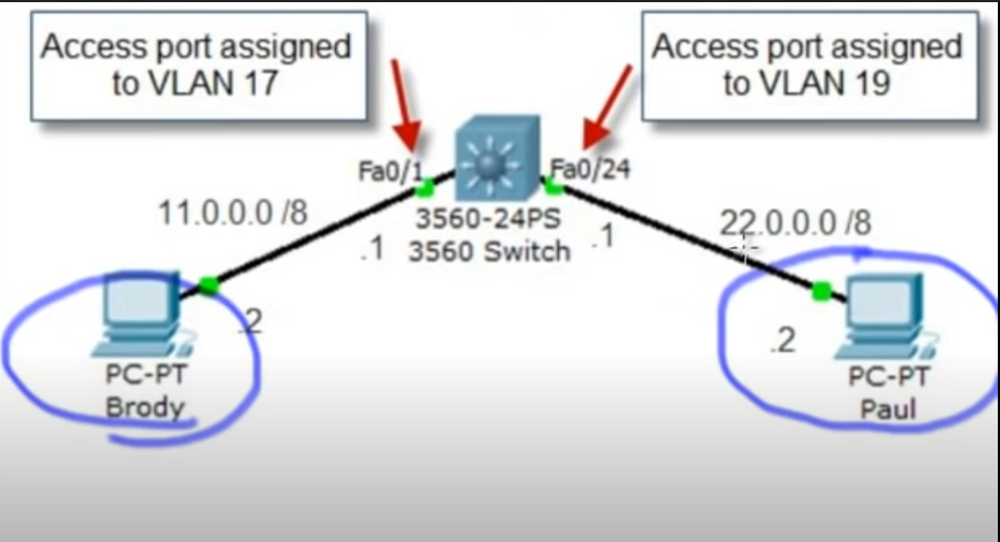

# Difference between VLAN and Interface VLAN

## Answer

VLAN groups together a subset of devices that share a physical LAN, isolating the traffic for each group.

Interface VLAN (aka Switched Virtual Interface, Management Interface) is virtual interface that is attached to the physical network port or bond that your VLAN is configured on.

## Example



Brody has the IP 11.0.0.2 and is located in VLAN 17. On the other hand, Paul has the IP 22.0.0.2 and is located in VLAN 19. Both Brody and Paul are unable to ping to the L3 switch, as no IP addresses are configured on the L3 switch. However, after running the following command on the L3 switch, both are able to communicate to Fa0/1 and Fa0/24 respectively.

```
config t
int vlan 17
ip addr 11.0.0.1 255.0.0.0
int vlan 19
ip addr 22.0.0.1 255.0.0.0
```

Use the command `ip routing` to allow Brody to reach Paul. 