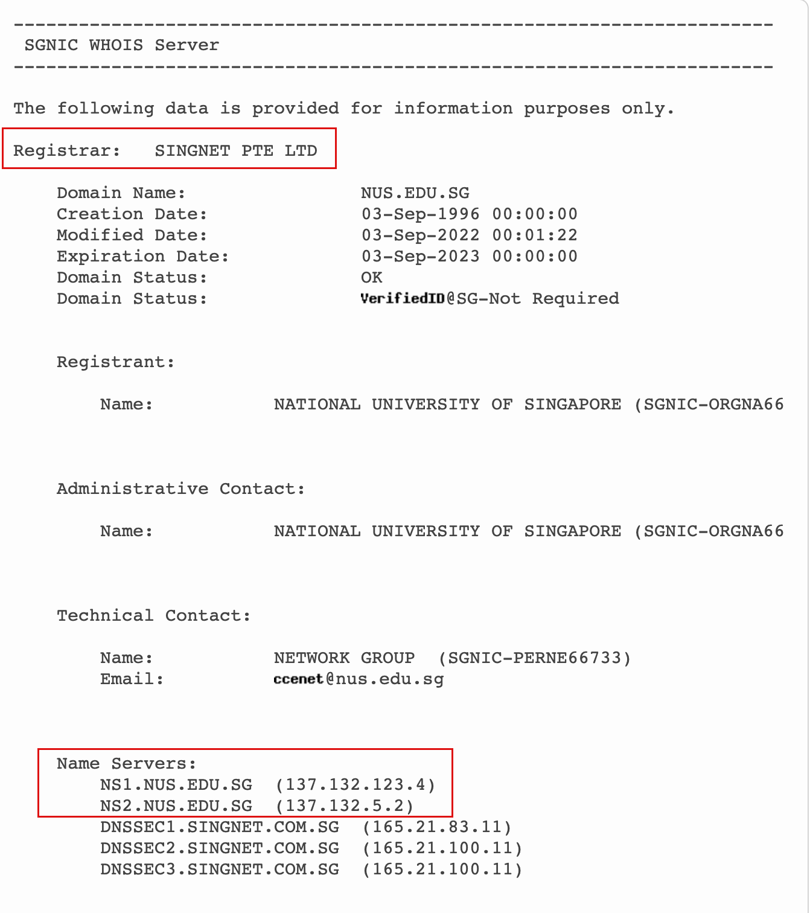
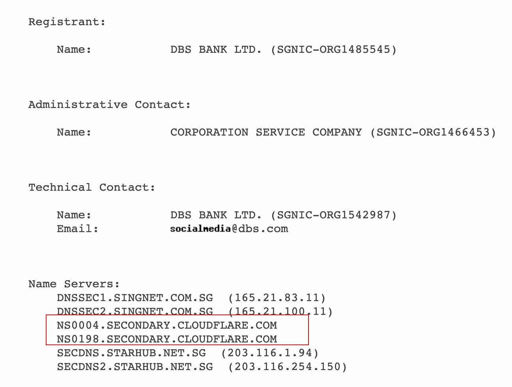
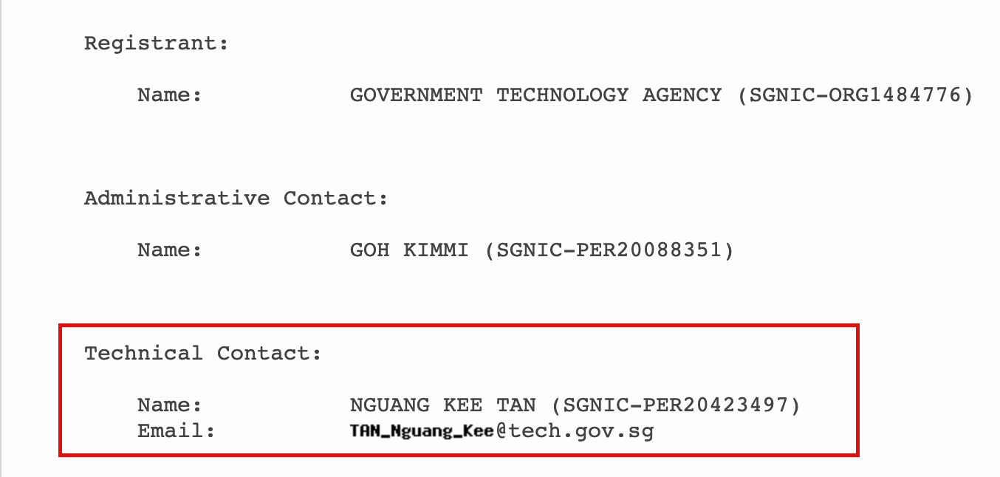
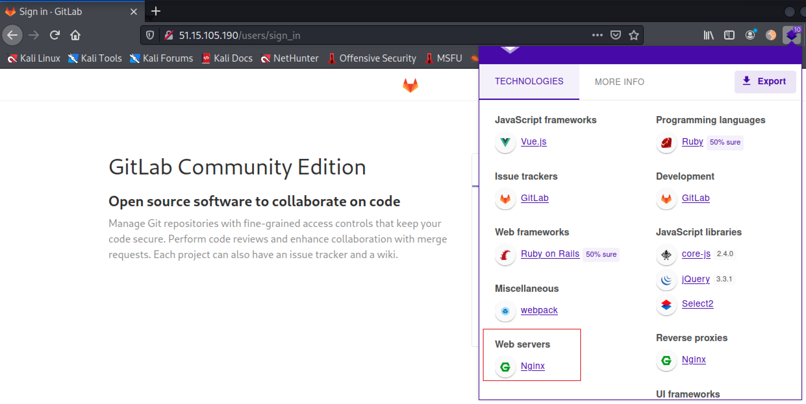
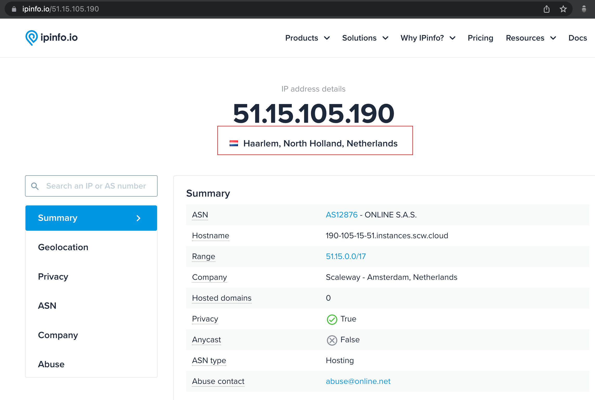
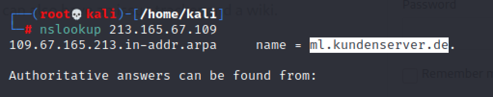

# Security Analytics (Practical 1)

## Challenge: 

## Solution:

The practical requires us to use OSINT tools such as whois, Nmap, CVEs details to obtain answers for the various exercises.

### Exercise 1.1
I used `whois` to obtain the following information. 

There are 2 name servers, which are `NS1.NUS.EDU.SG`  (137.132.123.4) and `NS2.NUS.EDU.SG`  (137.132.5.2). The ISP is SINGNET PTE LTD.

### Exercise 1.2 
I deduced that the term `network resource replicator` means Content Delivery Networks (CDN). Using `whois`, I was able to find `Cloudfare` as the CDN.

### Exercise 1.3 
Using `whois` once more, I was able to find the web administrator name as `Nguang Kee Tan`. His email is `TAN_Nguang_Kee@tech.gov.sg`.

### Exercise 2.1

Running `nmap`, I found that ports 22 and 80 were open. `OpenSSH 7.2p2` was used by the SSH server. 

Using `Wappalyzer`, I found that the web server is running `Nginx`. Some of the Web technologies used were `Ruby On Rails`, `Vue.js`, `JQuery`.

I used `ipinfo.co` to find out the country that the IP address is allocated to. I found that it is in the Netherlands.

### Exercise 2.2
It belongs to `kundenserver` organization. The domain name serving on this IP addresses is `ml.kundenserver.de`.

### Exercise 3.1(Heartbleed)
* CVE: [CVE-2014-0160](https://cve.mitre.org/cgi-bin/cvename.cgi?name=cve-2014-0160)
* Root Cause: Allows remote attackers to obtain sensitive information from process memory via crafted packets that trigger a buffer over-read
* Vuln Versions: OpenSSL 1.0.1 before 1.0.1g
  
### Exercise 3.1(Spectre)
* CVE: [CVE-2017-5753](https://www.cve.org/CVERecord?id=CVE-2017-5753) [CVE-2017-5715](https://www.cve.org/CVERecord?id=CVE-2017-5715)
* Root Cause: Allow unauthorized disclosure of information to an attacker with local user access via a side-channel analysis. 
* Vuln Versions: Spectre-V1, Spectre 1.0, Spectre-V2

### Exercise 3.2(Meltdown)
* CVE: [CVE-2017-5754](https://cve.mitre.org/cgi-bin/cvename.cgi?name=CVE-2017-5754)
* Root Cause: Allow unauthorized disclosure of information to an attacker with local user access via a side-channel analysis of the data cache.
* Vuln Versions: At the time of disclosure (2018), this included all devices running any but the most recent and patched versions of iOS, Linux,macOS, or Windows.

### Exercise 3.3(Eternal blue)
* CVE: [CVE-2017-0144](https://cve.mitre.org/cgi-bin/cvename.cgi?name=cve-2017-0144)
* Root Cause: Allows remote attackers to execute arbitrary code via crafted packets, aka "Windows SMB Remote Code Execution Vulnerability."
* Vuln Versions: The SMBv1 server in Microsoft Windows Vista SP2; Windows Server 2008 SP2 and R2 SP1; Windows 7 SP1; Windows 8.1; Windows Server 2012 Gold and R2; Windows RT 8.1; and Windows 10 Gold, 1511, and 1607; and Windows Server 2016.

### Exercise 3.4(Print Nightmare)
* CVE: [CVE-2021-34527](https://msrc.microsoft.com/update-guide/vulnerability/CVE-2021-34527)
* Root Cause: A remote code execution vulnerability exists when the Windows Print Spooler service improperly performs privileged file operations.
* Vuln Versions: When released in 2021, it affected every version of Windows.

