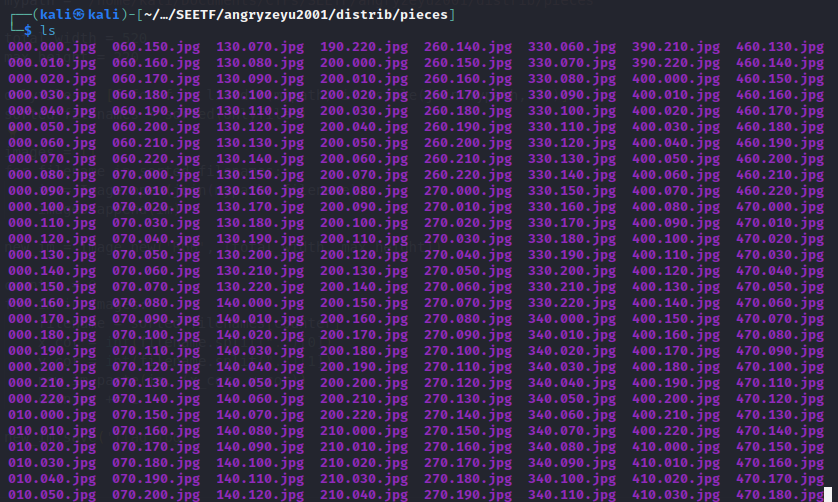
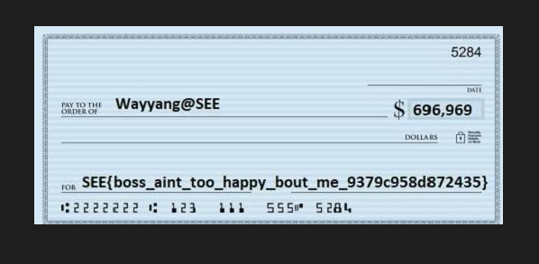

# SEETF (Angry Zeyu2001)

## Challenge: 


## Solution:
This challenge contains numerous fragments of the flag. We need to join all the fragments to obtain the flag.

Upon unzipping the challenge file, we obtained numerous files with the naming convention XXX.YYY.jpg. This suggests to us that the filename is the X and Y coordinates of the flag.



We know that the width and height of the final flag is 520px and 220px respectively since the last fragments has the filename 520.220.jpg.


Hence, we wrote the following script to recover the flag, with help from [link 1](https://stackoverflow.com/questions/30227466/combine-several-images-horizontally-with-python) and  [link2](https://stackoverflow.com/questions/3207219/how-do-i-list-all-files-of-a-directory).

```
import sys
from PIL import Image
from os import listdir
from os.path import isfile, join

mypath = "/home/kali/Documents/CTFs/SEETF/angryzeyu2001/distrib/pieces"

total_width = 520
max_height = 220

onlyfiles = [f for f in listdir(mypath) if isfile(join(mypath, f))]
sorted_filenames = sorted(onlyfiles)

images = []
for filename in sorted_filenames:
    im = Image.open(join(mypath, filename))
    images.append(im)

new_im = Image.new('RGB', (total_width, max_height))

counter = 0
for im in images:
    filename = sorted_filenames[counter]
    x_cor = int(filename.split(".")[0])
    y_cor = int(filename.split(".")[1])
    new_im.paste(im, (x_cor, y_cor))
    counter += 1

new_im.save('flag.jpg')
```

Volia! We successfully recovered the flag.

