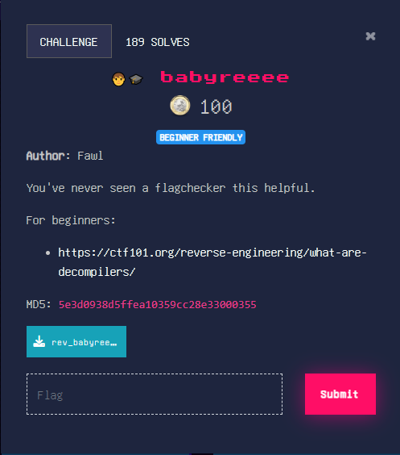
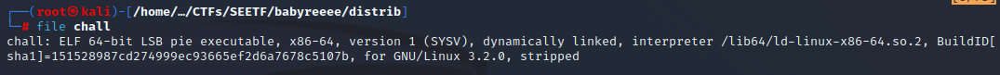
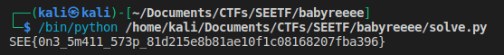

# SEETF (babyreeee)

## Challenge: 



## Solution:
The challenge is to decompile the source code and to reverse the flag checking operation.

After downloading the source code, we ran the `file` command on it and obtained the following. 

We could see that it was a stripped ELF file. This indicates that symbols (references to some type of data like an import, a global variable, or a function), would not be present.

Using GDB's `info function`, we could see that the main function was not present, and can only see the imports from libc. 


Next, we used Ghidra to decompile the file. From the Symbol Tree, we could see an entry function. 

Clicking into the main function that was being called, we decompiled and obtained the following code.

```
undefined8 main(void)

{
  char *pcVar1;
  undefined4 *puVar2;
  byte bVar3;
  size_t sVar4;
  ulong uVar5;
  ulong uVar6;
  char local_158 [128];
  undefined4 local_d8 [4];
  undefined4 local_c8;
  undefined4 uStack196;
  undefined4 uStack192;
  undefined4 uStack188;
  undefined4 local_b8;
  undefined4 uStack180;
  undefined4 uStack176;
  undefined4 uStack172;
  undefined4 local_a8;
  undefined4 uStack164;
  undefined4 uStack160;
  undefined4 uStack156;
  undefined4 local_98;
  undefined4 uStack148;
  undefined4 uStack144;
  undefined4 uStack140;
  undefined4 local_88;
  undefined4 uStack132;
  undefined4 uStack128;
  undefined4 uStack124;
  undefined4 local_78;
  undefined4 uStack116;
  undefined4 uStack112;
  undefined4 uStack108;
  undefined4 local_68;
  undefined4 uStack100;
  undefined4 uStack96;
  undefined4 uStack92;
  undefined4 local_58;
  undefined4 uStack84;
  undefined4 uStack80;
  undefined4 uStack76;
  undefined4 local_48;
  undefined4 uStack68;
  undefined4 uStack64;
  undefined4 uStack60;
  undefined4 local_38;
  undefined4 uStack52;
  undefined4 uStack48;
  undefined4 uStack44;
  undefined4 local_28;
  undefined4 uStack36;
  undefined4 uStack32;
  undefined4 uStack28;
  undefined4 local_18;
  undefined4 uStack20;
  undefined4 uStack16;
  undefined4 uStack12;
  
  puts("Hello! Welcome to SEETF. Please enter the flag.");
  local_d8[0] = 0x98;
  local_d8[1] = 0x8b;
  local_d8[2] = 0x88;
  local_d8[3] = 0xc3;
  local_c8 = 0x71;
  uStack196 = 0xb6;
  uStack192 = 0x7e;
  uStack188 = 0xa3;
  local_b8 = 0x72;
  uStack180 = 0xbb;
  uStack176 = 0x73;
  uStack172 = 0x7d;
  local_a8 = 0x7a;
  uStack164 = 0xa9;
  uStack160 = 0x74;
  uStack156 = 0x73;
  local_98 = 0x68;
  uStack148 = 0xa4;
  uStack144 = 0xb6;
  uStack140 = 0x6e;
  local_88 = 0x62;
  uStack132 = 0xbc;
  uStack128 = 0x61;
  uStack124 = 0x61;
  local_78 = 0x62;
  uStack116 = 0xb3;
  uStack112 = 0x67;
  uStack108 = 0xbc;
  local_68 = 0x61;
  uStack100 = 0x6b;
  uStack96 = 0xb8;
  uStack92 = 0xb5;
  local_58 = 0x56;
  uStack84 = 0x54;
  uStack80 = 0x89;
  uStack76 = 0x55;
  local_48 = 0x8c;
  uStack68 = 0x50;
  uStack64 = 0x5b;
  uStack60 = 0x51;
  local_38 = 0x53;
  uStack52 = 0x54;
  uStack48 = 0x5d;
  uStack44 = 0x5e;
  local_28 = 0x50;
  uStack36 = 0x86;
  uStack32 = 0x89;
  uStack28 = 0x89;
  local_18 = 0x48;
  uStack20 = 0x4f;
  uStack16 = 0x49;
  uStack12 = 0xf1;
  fgets(local_158,0x80,stdin);
  sVar4 = strlen(local_158);
  if (sVar4 == 0x35) {
    puts("Good work! Your flag is the correct size.");
    puts("On to the flag check itself...");
    sVar4 = strlen(local_158);
    uVar5 = 0;
    do {
      uVar6 = uVar5 & 0xffffffff;
      if (sVar4 - 1 == uVar5) {
        puts("Success! Go get your points, champ.");
        return 0;
      }
      pcVar1 = local_158 + uVar5;
      puVar2 = local_d8 + uVar5;
      bVar3 = (byte)uVar5;
      uVar5 = uVar5 + 1;
    } while ((byte)*puVar2 == (byte)(*pcVar1 + 0x45U ^ bVar3));
    printf("Flag check failed at index: %d",uVar6);
  }
  else {
    printf("Flag wrong. Try again.");
  }
  return 1;
}
```
After renaming the variables to more meaningful names, our decompiled code looks like this. 

From line number 117, we could see that the length of the flag was 53 characters. However, we need to take into account the [null byte](https://stackoverflow.com/questions/20161921/null-byte-and-arrays-in-c) present at the end of the string. Hence, the length of the string that we provide must be 52 characters.

From line 129, it is evident that the encoded flag character was obtained from local_d8, which was part of the stack.

Furthermore, from line 132, we could see that each user's input character is added 69 in decimal, followed by the XOR operation with the counter's value. Hence, our decoding script should XOR each of the encoded flag character, followed by subtracting 69 in decimal and obtaining the ASCII representation of the result.

To decode, we copied the all the encoded values to a text file named stack.txt. Next, we used the following script to decode each of the encoded character on the stack.

```
import re
hex_list_in_decimal = []
decrypted_flag_list = []

with open("stack.txt", "r") as f:
    line = f.readline()
    while line != '':
        hex_num = re.search(r'0[xX]([0-9a-fA-F]+)', line)
        decimal_representation = int(hex_num.group(1), 16)
        hex_list_in_decimal.append(decimal_representation)
        line = f.readline()

counter = 0
for hex_digit_in_deci in hex_list_in_decimal:
    xor_result = hex_digit_in_deci ^ counter
    decrypted_char = xor_result - 69
    decrypted_flag_list.append(chr(decrypted_char))
    counter += 1


print("".join(decrypted_flag_list))
```

After running the script, we obtained the flag. :') 
