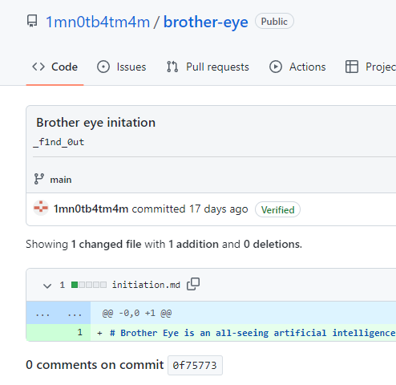
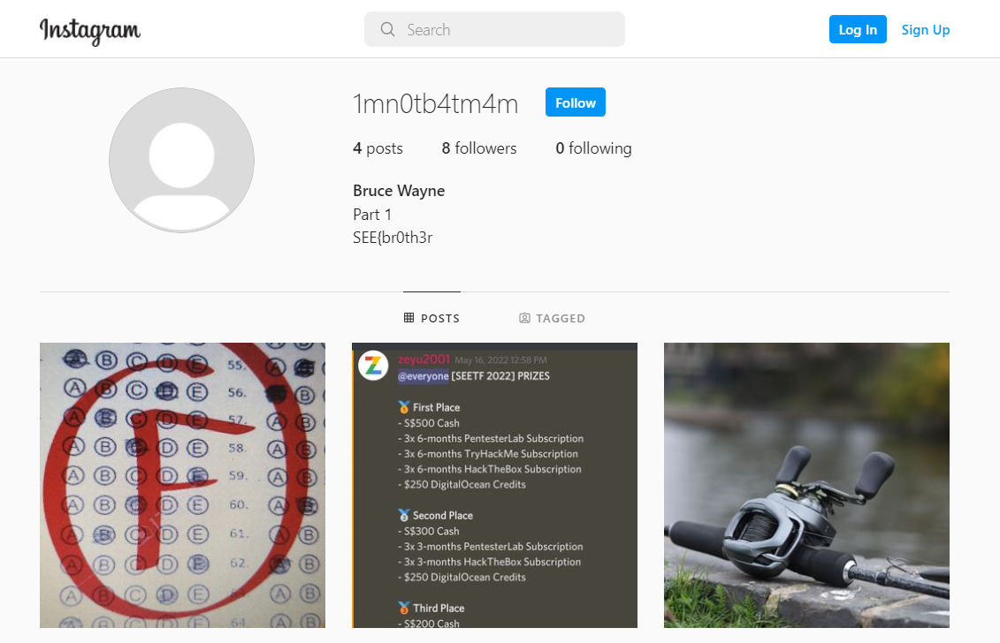
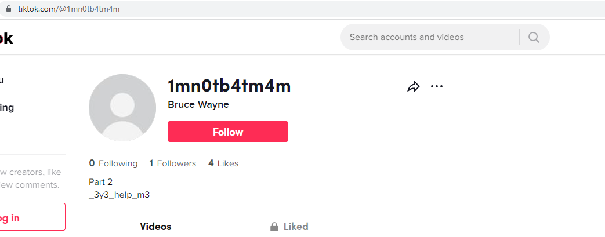
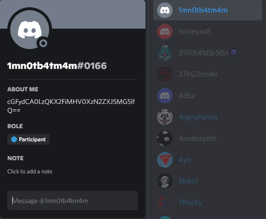

# SEETF (Official Cash Banking Company)

## Challenge: 


## Solution:
The challenge requires us to find 4 social media accounts with the username "1mn0tb4tm4m" 

Firstly, we used [sherlock](https://github.com/sherlock-project/sherlock) to find the various social media accounts. From the output, we found 1mn0tb4tm4m's Github and Instagram accounts.


Heading over to the Github account, we found part 3 flag. 



Going to the Instagram account, we found the part 1 flag.



Next, we decided to search the profile on Tiktok. Sure enough, we found the part 2 flag.



Finally, we decided to head over to the SEETF offical Discord server and found a user named "1mn0tb4tm4m". The user's bio is a base64 encoded string which could be decoded to the part 4 flag.



```
part 4/4
_ab0ut_3very0ne}
```

Combing the 4 flag fragments, we obtained the complete flag `SEE{br0th3r_3y3_help_m3_f1nd_0ut_ab0ut_3very0ne}`