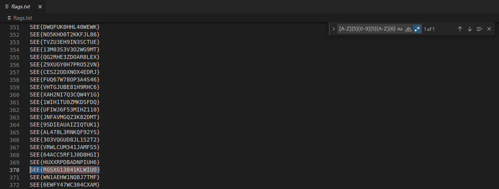

# SEETF (Best Software)

## Challenge: 

## Solution:
The challenge is to use Regex to filter out the flag that meets the stated requirements of 5 uppercase letters, followed by 5 digits and another 6 uppercase letters.

After we opened flag.png, we were greeted many close to 3000 flags. Using Visual Studio Code's regex search and providing the search string as `[A-Z]{5}[0-9]{5}[A-Z]{6}`, we were able to find the flag.

