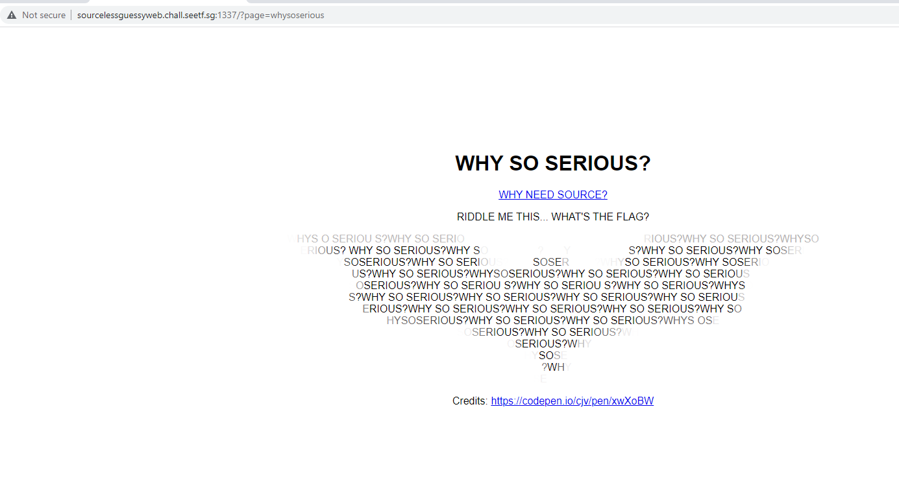
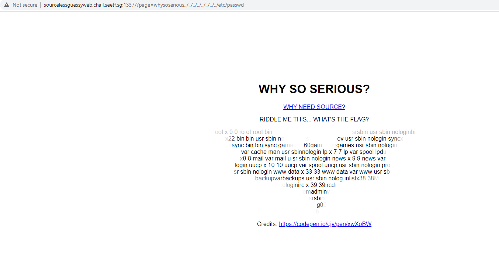

# SEETF (Sourceless Guessy Web (Baby Flag))

## Challenge: 

## Solution:
This challenge requires us to perform [Local File Inclusion](https://portswigger.net/web-security/file-path-traversal) to obtain the flag.

Heading over to the challenge site, we saw a GET parameter with the value whysoserious.

Trying out LFI to /etc/password, by modifying the GET parameter to be `../../../../../../../../etc/passwd`, we obtained the flag in the source code.

