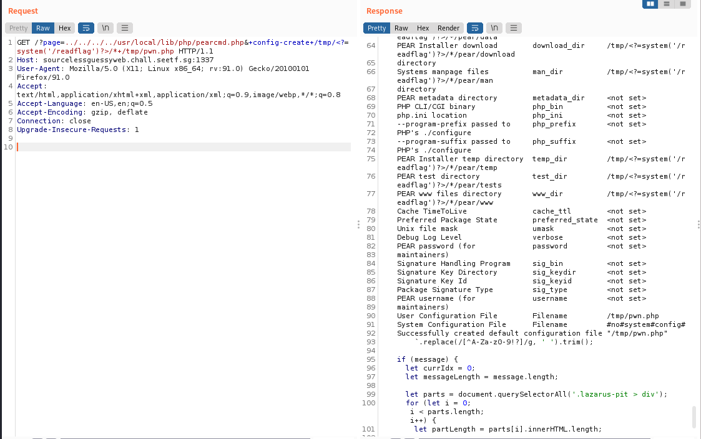

# SEETF (Sourceless Guessy Web (Baby Flag))

## Challenge: 

## Solution:
This challenge requires us to make use of pearcmd.php to obtain remote code execution (rce), allowing us to obtain the flag.

Heading over to the challenge site, we can see a URL called "WHY NEED SOURCE?". 

Clicking on the link allows us to shows us a URL that includes in "register_argc_argv". This shows that "register_argc_argv" was enabled on the machine.

Searching online, we found this [link](https://github.com/w181496/Web-CTF-Cheatsheet#pear), which shows that it is possible to conduct RCE on the machine if "register_argc_argv" and "pearcmd.php" have been installed.

Next, we captured the request to the site on Burp and changed the GET request to `GET /?page=../../../../usr/local/lib/php/pearcmd.php&+config-create+/tmp/<?=system('/readflag')?>/*+/tmp/pwn.php HTTP/1.1`. This command gave us the following output.

Finally, we need use Local File Inclusion (LFI) to include in the /tmp/pwn.php file to get the flag.

