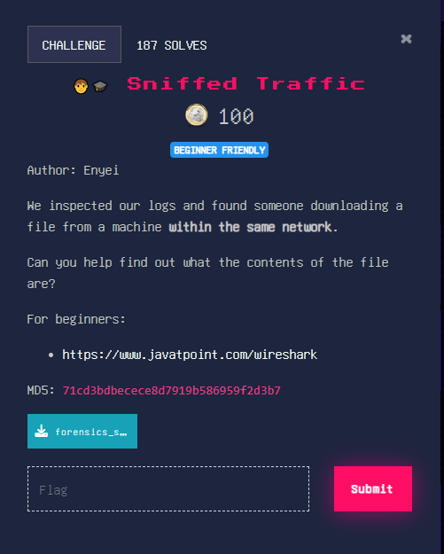
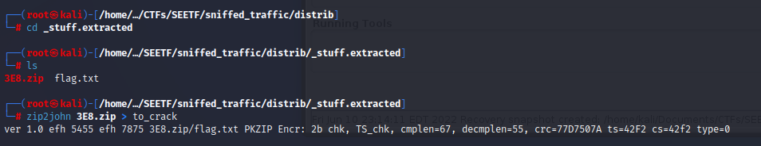
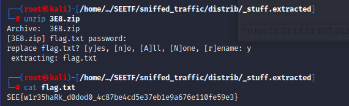

# SEETF (Sniffed Traffic)

## Challenge: 

## Solution:
The challenge is to analyze the wireshark data to obtain a password-protected zip file and to subsquently crack the passwords.

After downloading the provided PCAP file, we used wireshark to analyze the packets. Using Wireshark's export objects --> HTTP function, we managed to find a zip file named thingamajig.zip. 

Next, we saved the zip file and proceeded to unzip it. However, it was password-protected.

Next, we went back to Wireshark for further analysis by following the tcp stream of the zip file. 

From the TCP stream, we found that the server was running Python SimpleHTTP. Clicking on the next TCP stream, we found the password for the zip file.

Afterwards, we extracted the first zip file.

After running `strings` on the extracted file, we saw flag.txt as the output.

This suggests that "stuff" may be a zip file that contains flag.txt. Hence, we tried using the `unzip` command. 

Since we do not know the second password, we wanted to use ``zip2john`` to convert it into a format that john is able to crack. 

Since we failed running `zip2john`, we decided to use `binwalk` to carve out the zip file.

Next, we tried to use the `zip2john` command again on the file extracted by `binwalk`.

Moving on, we used `john` and the rockyou.txt worldist to brute force the password.

Using the password "john", we were able to unzip the password-protected file and obtain the flag.

