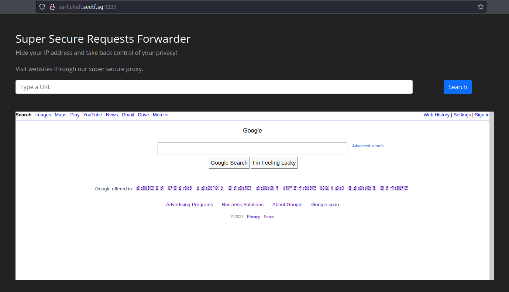
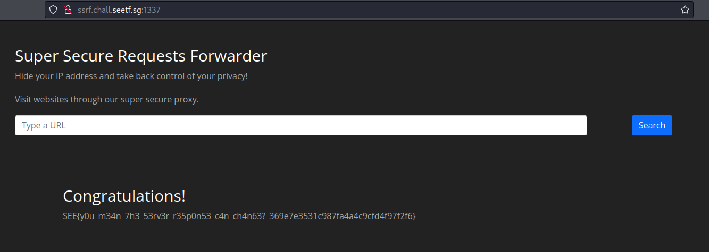

## Super Secure Requests Forwarder (SEETF)

### Challenge: 

### Solution:

The challenge is to exploit the website with [Server-side Request Forgery](https://portswigger.net/web-security/ssrf).

Looking at lines 16-22 of source code provided, we could see that the code was using the Python library [Advocate](https://github.com/JordanMilne/Advocate) to ensure that the user input could not trigger SSRF. From lines 28-31, it is evident that by suppling the URL 127.0.01/flag, we were able to obtain the flag. 

If we visit a site such as www.google.com, the output would be shown through the SSRF website. 

However, if we were to visit 127.0.0.1 or equivalent domains such as [public domains that are resolved to 127.0.0.1](https://gist.github.com/tinogomes/c425aa2a56d289f16a1f4fcb8a65ea65), we would obtain the following output. 

Next, we ran a HTTP server using Python and used ngrok to make the HTTP server publicly acessible. 

    python3 -m http.server
    ngrok http 8000

After we input the ngrok IP into the SSRF browser, we obtained 2 GET requests to our Python server.

Why 2? It is because on line 17 of the code, advocate.get() will test the URL that was input by the user and if the URL was not causing SSRF, then on line 22, the request is made again to that URL. However, the second request was made using the default Requests python library, which does not check for SSRF. 

Hence,we created a flask app that will send a non-SSRF URL during the first GET request and redirect to the 127.0.0.1/flag URL during the second GET request. 

Setting up the flask server locally and using ngrok to obtain a publicly-accessible URL.

    flask run
    ngrok http 5000

After supplying the ngrok IP as the URL, we obtained the flag. :)

