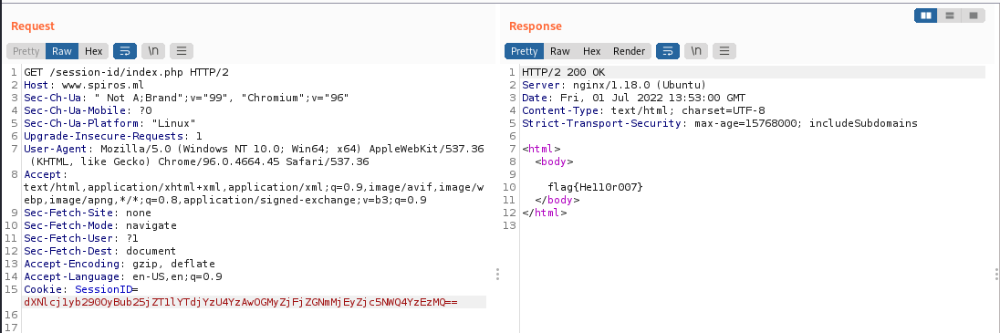

# SPIROS (Session Management)

## Challenge: 


## Solution (Timing Attack):
This challenge requires us to generate the current UNIX timestamp, supplying it in the cookie value `Chase=$timestamp`.

With the following script, we were able to obtain the current UNIX timestamp and send it to the webserver as a cookie.

```
#!/bin/bash

while true; do
    timestamp=$(date +%s)
    curl --cookie Chase=$timestamp https://www.spiros.ml/session-id/chase.php
done
```
Running the above script, we were able to obtain the flag! :')


## Solution (Structured-Token Attack):
This challenge requires us to analyze the SessionID provided and to alter it to gain access to the admin account.

The provided cookie was `SessionID=dXNlcj1henVyZXVzZXI7IG5vbmNlPTU4MWJlMDIyN2E0Y2JiYTY4YmNkM2VlOWY1NGI2OTY1`. Converting it from Base64 in CyberChef, we obtained the following result.


`user=azureuser; nonce=581be0227a4cbba68bcd3ee9f54b6965` tells us that the current user was azureuser and the nonce, which is the one-time use password is some sort of hashed value.

Using CyberChef's analyze hash function, we found that the hash could likely be a MD5 hash.


Next, we decided to hash the first half of the cookie, namely the string `user=azureuser`. This allowed us to obtain the provided nonce value of `581be0227a4cbba68bcd3ee9f54b6965`. Therefore, we were able to confirm that the nonce is generated using the specified username.


Moving on, we tried to change the usernames to popular administrator usernames like `root`. 


Next, we were able to base64 the username and nonce to obtain the cookie.


Finally, using Burpsuite Repeater, we were able to input in the newly found cookie in the HTTP GET request for the site (`SessionID=dXNlcj1yb290OyBub25jZT1lYTdjYzU4YzAwOGMyZjFjZGNmMjEyZjc5NWQ4YzEzMQ==`). This allowed us to obtain the flag.




