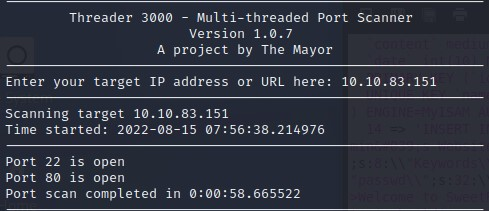
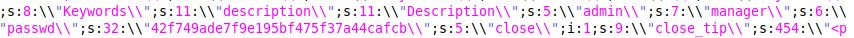

# TryHackMe (LazyAdmin)

## Challenge: 

## Solution:
This challenge requires us to gain RCE on SweetRice CMS v1.5.1, followed by privilege escalation using incorrect file permissions.

To start off, I used Threader3000 to scan the host, finding ports 22 and 80 to be open.

Next, I ran the relevant Nmap commands to further enumerate the open ports.

Following that, I ran `dirsearch -u 10.10.83.151 -X -x 400,500 -r -f -t 100 -w /usr/share/seclists/Discovery/Web-Content/directory-list-2.3-medium.txt` and found several subdomains such as `/content`.

Next, I enumerated the `/content` subdomain even further.

Then, I visited the `/content/as` and `/content/inc` subdomains. `/content/as` seems to be the login page for SweetRice CMS. `/content/inc` seems to contain numerous website files.

Upon further enumeration inside the `/content/inc` subdomain, I found an SQL backup file.

Opening the backup file, I found the username `manager` and the password hash.

Next, I pasted the hash into [a MD5 reversing site](https://md5.gromweb.com/) and found the password to be `Password123`.

Moving on, I managed to login to the `/content/as` page.

Next, I decided to use the `theme` tab to send in my PHP reverse shell.

For the PHP reverse shell, I used the one provided by Pentest Monkey and uploaded the zipped PHP reverse shell file.

Next, I went to `/content/_themes` to view the uploaded reverse shell.

From there, I was able to gain a reverse shell.

For privilege escalation, I decided to use `sudo -l` to list the allowed (and forbidden) commands for the invoking user.

The `/etc/copy.sh` file is a reverse shell by [Pentest Monkey](https://pentestmonkey.net/cheat-sheet/shells/reverse-shell-cheat-sheet). 

Next, I viewed the file permissions for the `/etc/copy.sh` file and found that the `www-data` user have write permissions.

Moving on, I edited the IP address to my attacking IP and was able to gain a reverse shell as the root user.

